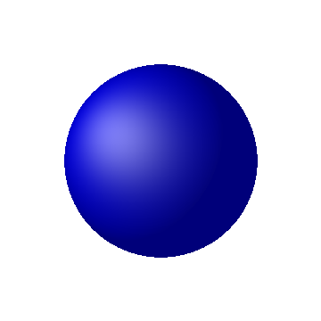
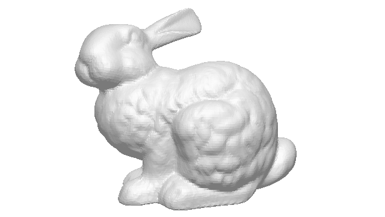
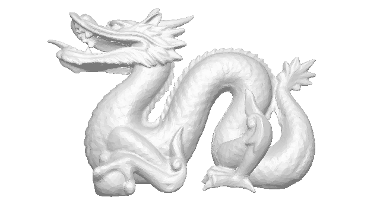
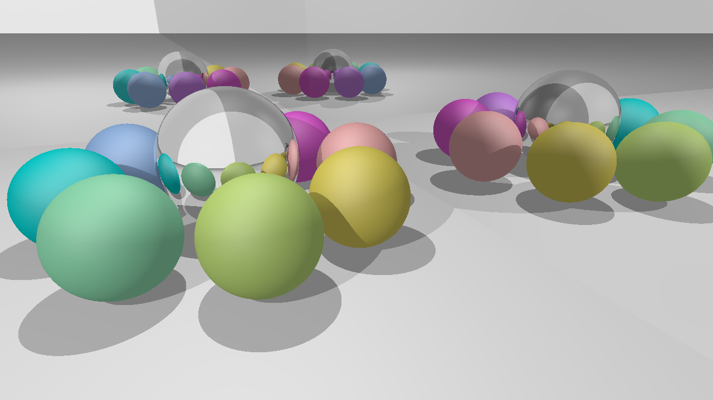

# *Raydiancy*: Ray Tracer

*Raydiancy* is a ray tracer written in [Rust](https://www.rust-lang.org/).
This is a side project that I work on for fun (and initially to learn Rust).
It's still in its early stages but already usable (see [**Examples**](#examples)).

## Features

* supported *object* types
  - [x] spheres
  - [x] triangles
  - [x] planes
  - [x] triangle meshes
* importing 3D models from *.obj* files (only limited support so far)
* supported *lighting*
  - [x] Phong model (ambient, diffuse, specular)
  - [x] shadows
  - [x] reflections (e.g. mirrors)
  - [x] refractions (e.g. glass)
* [x] *bounding volume hierarchies* (space partitioning for faster rendering)
* [x] alpha channel (transparent background)
* [ ] super-sampling for anti-aliasing
* [ ] textures
* [ ] parallel rendering
* [ ] Monte-Carlo ray tracing

## Build instructions

1.  [**Install Rust**](https://www.rust-lang.org/downloads.html)
    if it's not already installed on your system.
2. **Clone:**

    ```shell
    git clone https://github.com/fanzier/raydiancy.git
    cd raydiancy
    ```
3.  **Build:**

    ```shell
    cargo build --release
    ```
4.  **Run:**

    ```shell
    ./target/release/main
    ```
This renders a few example scenes and writes the output to `./output/`.

## Create your own scenes

The file [`src/bin/main.rs`](src/bin/main.rs) already contains a few example scenes.
You can add your own ones as follows.

1.  Write a function that returns your scene, for example:

    ```rust
    fn my_scene() -> Scene {
        Scene {
            camera: Camera {
                pos: Vec3::new(10.0, 10.0, 10.0),
                look_at: Vec3::zero(),
                up: Vec3::new(0.0, 1.0, 0.0),
                horizontal_fov: 120_f64.to_radians(),
                aspect_ratio: 1.0,
                width: 360,
                height: 360
            },
            objects: vec![Box::new(
                Sphere {
                    center: Vec3::zero(),
                    radius: 8.0,
                    material: color_material(Color::new(0.0, 0.0, 1.0))
            })],
            ambient_color: white(),
            lights: vec![LightSource {
                pos: Vec3::new(0.0, 10.0, 10.0),
                col: white()
            }]
        }
    }
    ```

    This scene includes
    * a blue sphere of radius 8 at the origin of the coordinate system and
    * a white light at coordinates (10, 10, 10).
2.  Add the line

    ```rust
    render!(my_scene);
    ```

    to the main function.
3.  Build and run the program as described above.
4.  The result is in `output/single_sphere.png`:

    

## Examples

The following images are the output of the scenes defined in
[`src/bin/main.rs`](src/bin/main.rs).

### Stanford bunny



### Stanford dragon



### Spheres and mirrors


